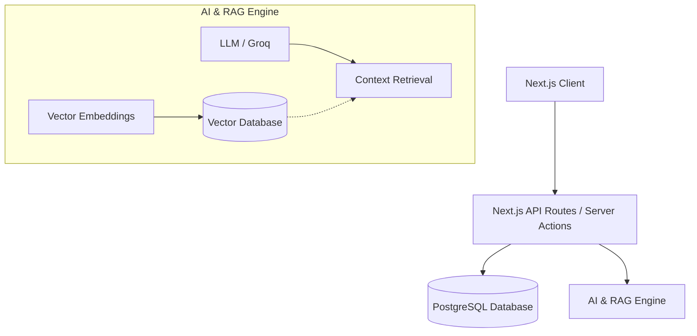

# ETHOS HRMS

ETHOS is a comprehensive Human Resource Management System built to streamline organizational workflows. Developed as a hackathon project, it aims to modernize HR processes through automation, intuitive interfaces, and AI-driven assistance.

## Overview

The platform provides a centralized hub for managing employees, attendance, payroll, leaves, and internal documents. It includes role-based access control (Admin, Manager, and Employee) to ensure that users see only the information relevant to their position.

A key highlight of ETHOS is the integrated AI Assistant, which leverages Retrieval-Augmented Generation (RAG) to provide instant, context-aware answers to HR-related queries based on company policies and documents.

## System Architecture

## Key Components

### 1. Role-Based Dashboards
- **Admin Dashboard**: Provides a bird's-eye view of the organization, including headcount, attendance trends, leave analytics, and payroll expenses.
- **Manager Dashboard**: Focuses on team-specific metrics, pending leave approvals, and team attendance.
- **Employee Dashboard**: A personal portal for checking in/out, viewing payslips, applying for leaves, and accessing documents.

### 2. Employee Management
A complete directory for managing employee profiles, roles, departments, and employment history. It supports comprehensive onboarding and offboarding workflows.

### 3. Attendance & Time Tracking
A real-time check-in and check-out system that logs daily working hours. It includes analytics for managers to monitor team availability and punctuality.

### 4. Leave Management
An end-to-end workflow for leave requests. Employees can apply for different types of leaves (sick, casual, annual), and managers or HR can approve or reject them directly from their dashboards.

### 5. Payroll & Salary Structures
Manages complex salary structures including base pay, allowances, and deductions. It allows HR to generate bulk payroll runs and distribute individual payslips automatically.

### 6. AI Assistant (RAG Integration)
To reduce the burden on HR staff, ETHOS includes a smart chat interface.
- **Retrieval-Augmented Generation (RAG)**: The system vectorizes company policies, documents, and FAQs. When an employee asks a question, it retrieves the most relevant document chunks and feeds them to the LLM to generate an accurate, company-specific response.
- **Technology**: Utilizes Groq for fast inference, combined with a vector database to store and query embeddings.

### 7. Analytics & Reporting
A dedicated analytics center for generating custom exports (CSV/PDF) on attendance, leaves, and overall organizational health.

## Technology Stack

- **Framework**: Next.js 15 (App Router, Server Actions)
- **Styling**: Tailwind CSS & shadcn/ui
- **Database**: PostgreSQL (via Prisma ORM)
- **AI/LLM**: Groq API
- **Authentication**: Custom session-based authentication

## Setup Instructions

1. Clone the repository.
2. Install dependencies using `npm install`.
3. Set up the environment variables (refer to `.env.example`).
4. Run database migrations: `npx prisma db push`.
5. Start the development server: `npm run dev`.
